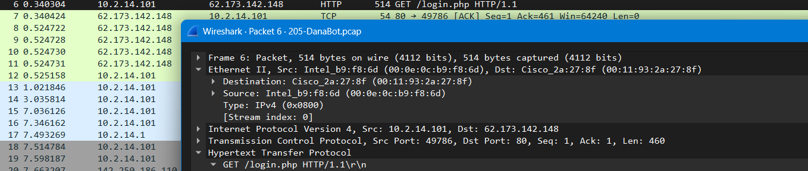
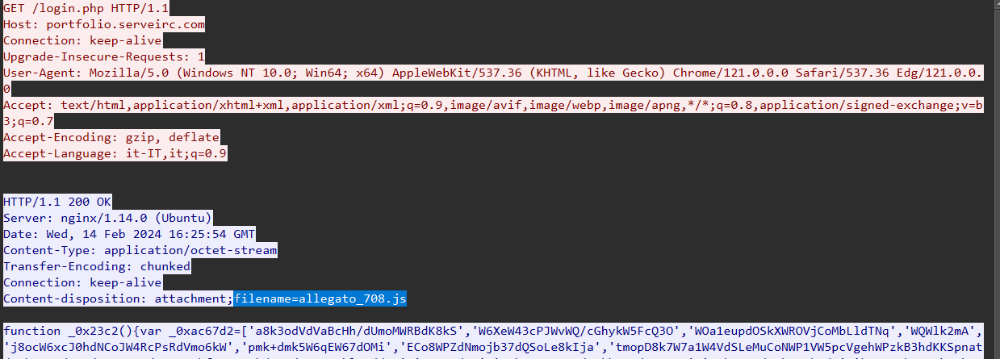
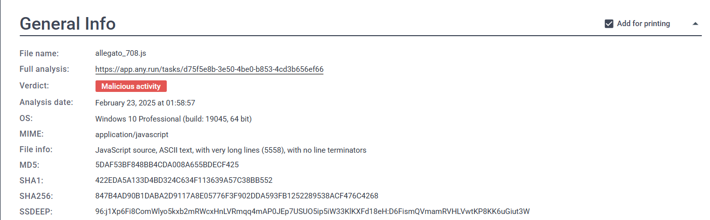
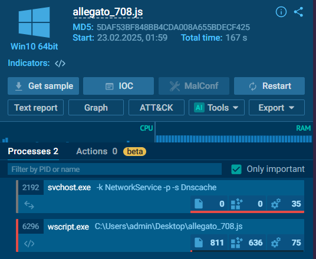
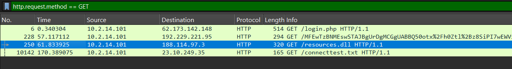
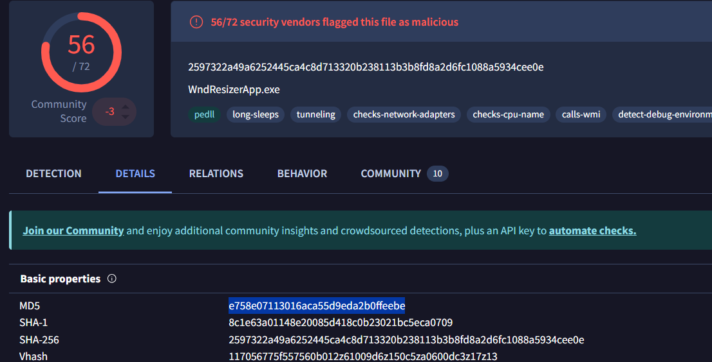

# DanaBot Lab

##  Incident Summary
A malware was executed on 10.2.14.101. It made `GET` request to c2 server 62.173.142.148 for login.php which is malicious, and have another name `allegato_708.js` (md5=5DAF53BF848BB4CDA008A655BDECF425) file. 
This file was used to make intitial access. Then `allegato_708.js` made contact with other c2 server (195.133.88.98) for second malicious file `resources.dll` which is actually a .exe file `"WndResizerApp.exe"`.
Malicious behaviour was detedcted

---

##  Investigation Process

- Analyzed PCAP file using Wireshark  
- Identified suspicious HTTP traffic  
- Extracted downloaded files  
- Checked file hash on VirusTotal  

---

## Key Findings

- Source IP: 195.133.88.95  
- Destination IP: 10.2.14.101  
- Suspicious file: resources.dll  
- Protocol: HTTP  
- Action: File download observed  

---

##  Analysis
The network traffic shows that the host initiated a connection to an external server and downloaded a file flagged as malicious. This indicates a likely payload delivery stage of an attack.
Malicious files were flagged as `Trojan` on threat intillegnce platforms like Virustotal. 

---

##  Impact Assessment

The download of a malicious file suggests potential system compromise. The file may allow unauthorized access or further malicious activity.

---

##  MITRE ATT&CK
### Tactic: Execution ,Command and Control
### T1218 , T1059 , T1566 ,T1071

# Questions :
## Q1 : Which IP address was used by the attacker during the initial access?
Malware made a request to c2 server and server's IP address is answer.

#### Answer : 62.173.142.148

## Q2 : What is the name of the malicious file used for initial access?
On investigation index.php file is accesses and if we look in TCP stream we can see a `.js ` file is accessed

#### Answer : allegato_708.js

## Q3 : What is the SHA-256 hash of the malicious file used for initial access?
If we look upon `allegato_708.js` on web, we can see any.run's report which have SHA-256 value.
(ALSO WE CAN CHECK MANUALLY BY SAVING FILE FROM WIRESHARK DIRECTLY {`its not safe`} File -> Export Object -> HTTP -> Save all), then checking SHA-256 sum.

#### Answer : 847B4AD90B1DABA2D9117A8E05776F3F902DDA593FB1252289538ACF476C4268

## Q4 : Which process was used to execute the malicious file?
On same ANY.RUN report we can see process that was used to run malicious file. 

#### Answer : wscript.exe

## Q5 : What is the file extension of the second malicious file utilized by the attacker?
This second mailicous file was downloaded by 1st malicious '`.js`' file. It's resources.dll

#### Answer : .dll

## Q6 : What is the MD5 hash of the second malicious file?
To check md5 hash of resources.dll file we can either websearch it on search engines `safe method` or 
WE CAN CHECK MANUALLY BY SAVING FILE FROM WIRESHARK DIRECTLY {`its not safe`} File -> Export Object -> HTTP -> Save all)
then uploading file on Virustotal !

#### Answer :  e758e07113016aca55d9eda2b0ffeebe

## THANKS > 3
