# Lespion - CyberDefenders 
### Link to lab - 
### Difficulty - Easy

#### In this Challenge we have a `.zip` file which have 3 files.

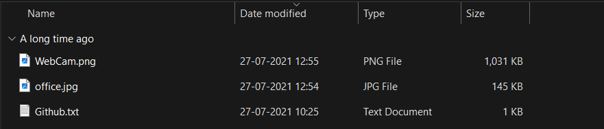

#### We have 2 imaages,1 text file. After opening the file we can see a github link.

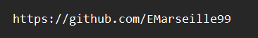

#### After opening url in browser we can see a github profile 

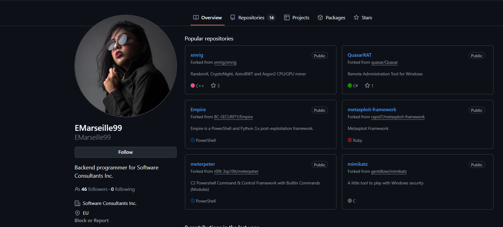

#### Lets do some OSINT now !

## Q1 - File -> Github.txt: What API key did the insider add to his GitHub repositories?
#### We have to find a API key, by going Repositories section we see a repository named `project build -custom login pages` that looked suspicious to me. I opened it and saw 2 javascript files.

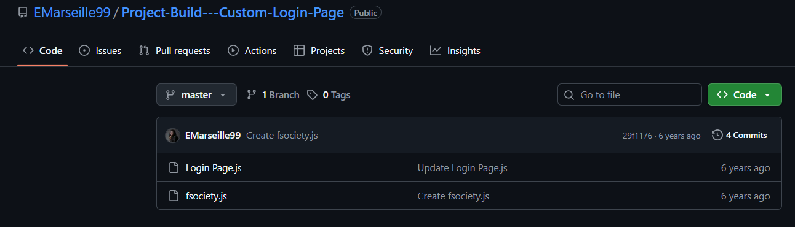

#### After opening `Login page.js` file we found API key

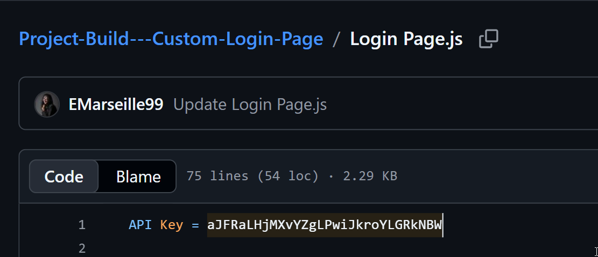

## Q2 - File -> Github.txt: What plaintext password did the insider add to his GitHub repositories?

#### On the same `Login page.js` page we can see password encoded with base64.

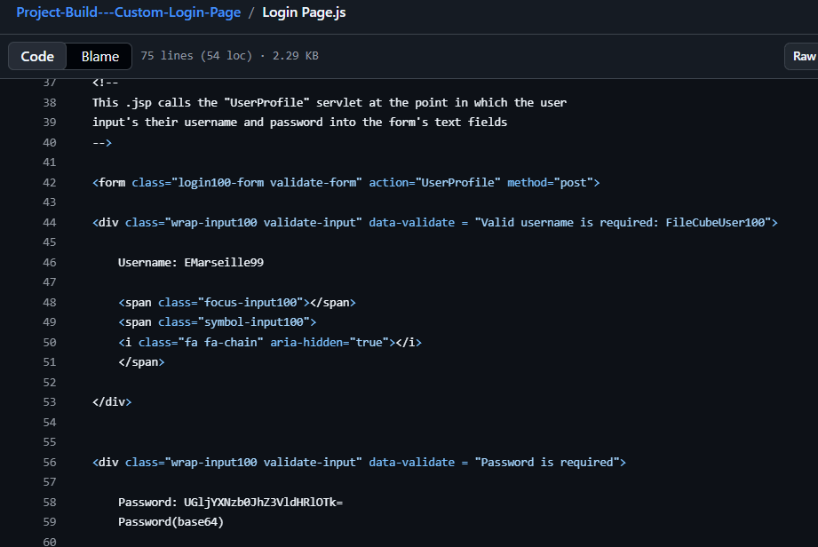

#### Since it is encoded, So we'll decode it. After decoding we found plaintext password.

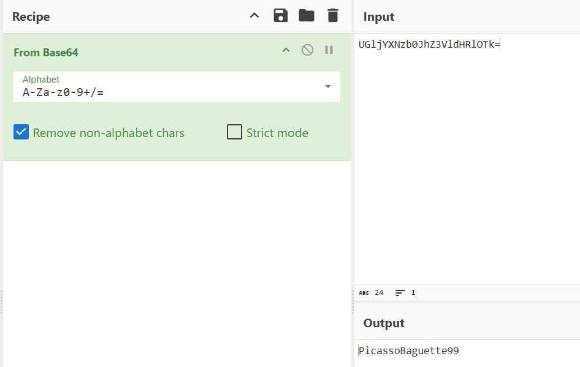

## Q3 - File -> Github.txt: What cryptocurrency mining tool did the insider use?

#### If we see carefully in repositories list we can see xmrig repository, which in description is miner. This tells it is a cryptocurrency mining tool.
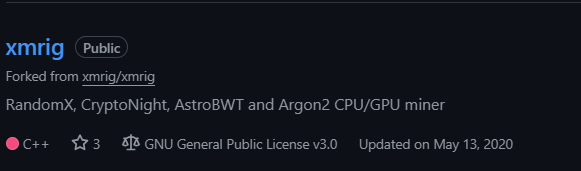

#### We can see full information of tool in readme file.

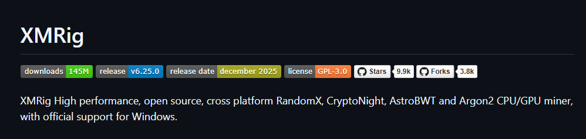

## Q4 - On which gaming website did the insider have an account?
#### Web searching the username we see on github can prrobably give us more websites this insider could've created account on.

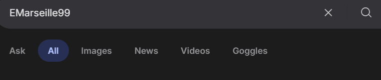

#### After scrolling we found the steam account of insider.

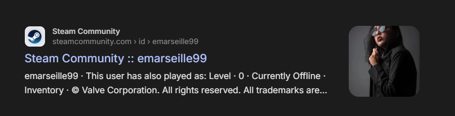

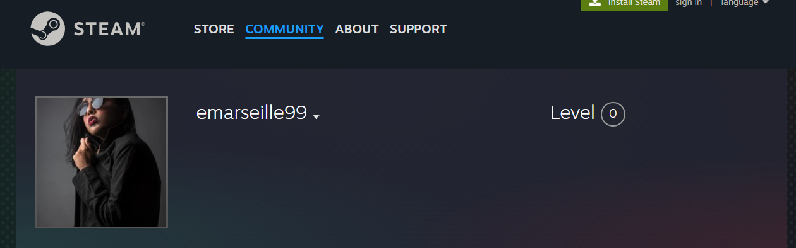

## Q5 - What is the link to the insider Instagram profile?

#### By websearch we also found the instagram account of insider.

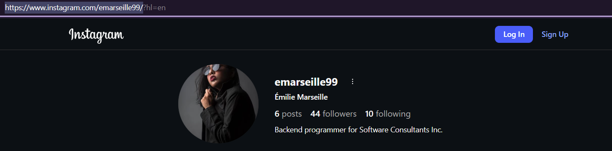

## Q6 - Which country did the insider visit on her holiday?

#### We can see few photos of insider on thier insatgram profile.
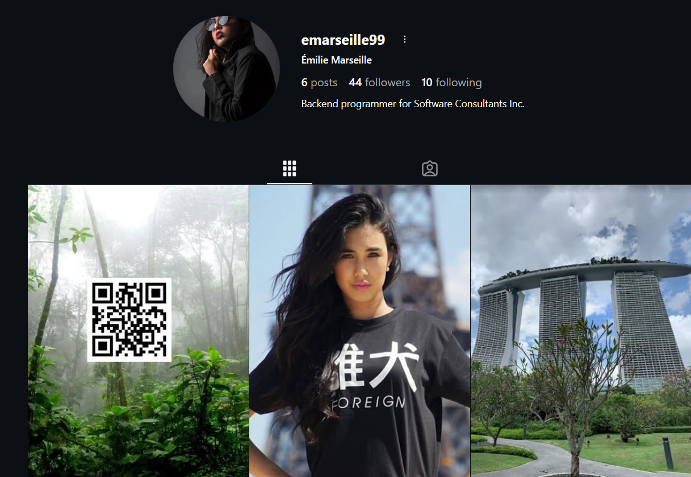

#### If we do search this image on image reverse search tool like google lens or tineye or microsoft bing, we can find some information.

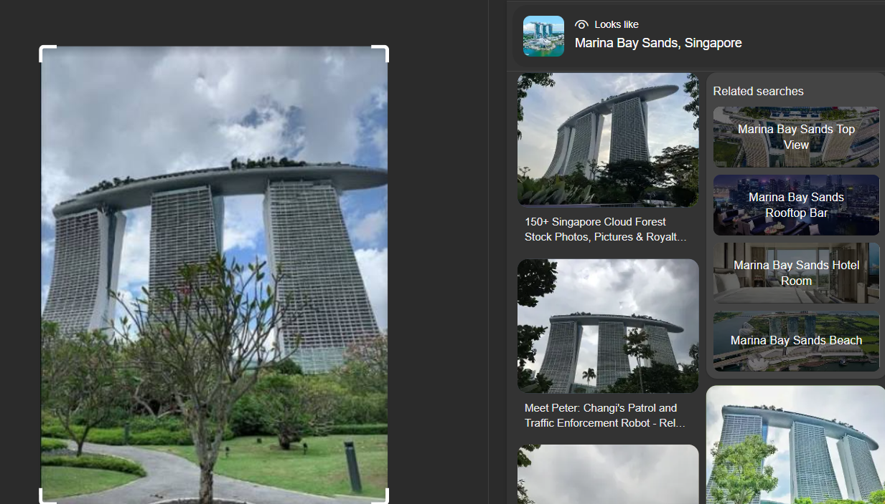

#### After doing reverse image search we found this building in photo is situated in a city and we got the location, there's high chance that insider could've visited to this city on her holiday.

## Q7 - Which city does the insider family live in?

#### Here we have few more photos which can tell us, where insider's family live or lived.

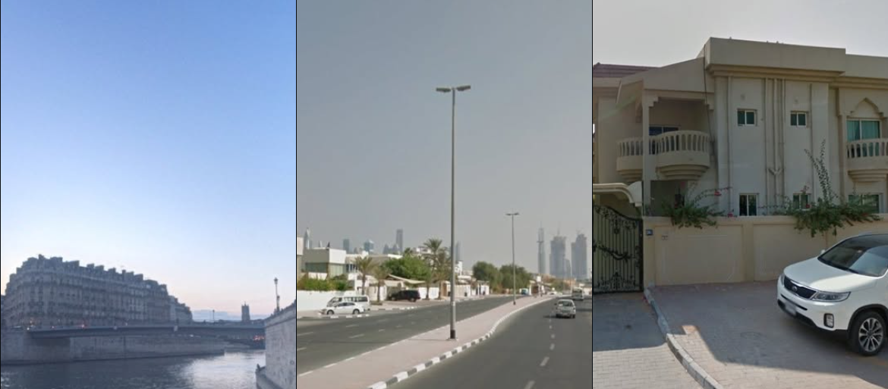

#### After reverse searching these images we found the location where insider's family live.

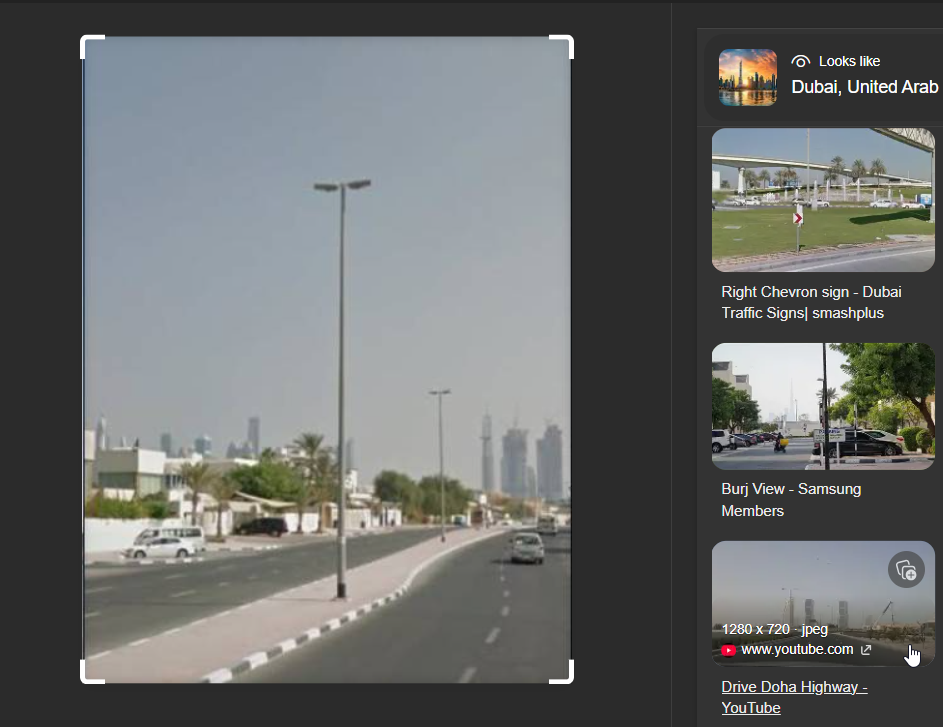

## Q8 - File -> office.jpg: You have been provided with a picture of the building in which the company has an office. Which city is the company located in?

#### When I tried reverse image searched `office.jpg`. i couldn't found accurate answer.

#### Then I opened image and saw texts on the sign board.

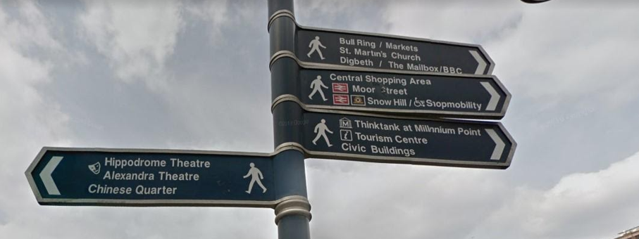

#### Then, I searched these text manually on web and found city where comapany is located. (I searched for moor street and found out it was loacated in birmingham and other seach locations too were pointing towards birmingham so that made it's probability much high)

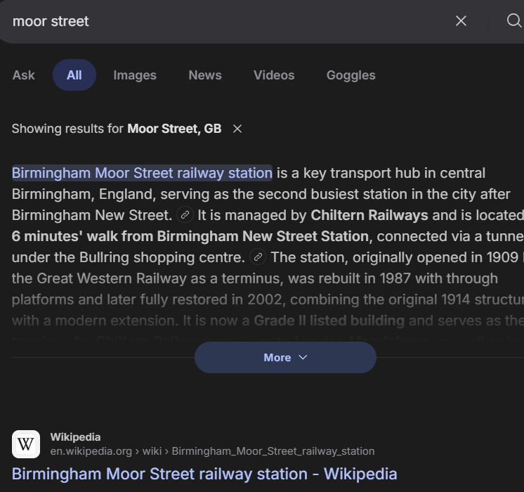

## Q9 - File -> Webcam.png: With the intel, you have provided, our ground surveillance unit is now overlooking the person of interest suspected address. They saw them leaving their apartment and followed them to the airport. Their plane took off and landed in another country. Our intelligence team spotted the target with this IP camera. Which state is this camera in?

#### I reverse seached this `Webcam.png` file on microsoft bing and found this image was in the megazine of a university.

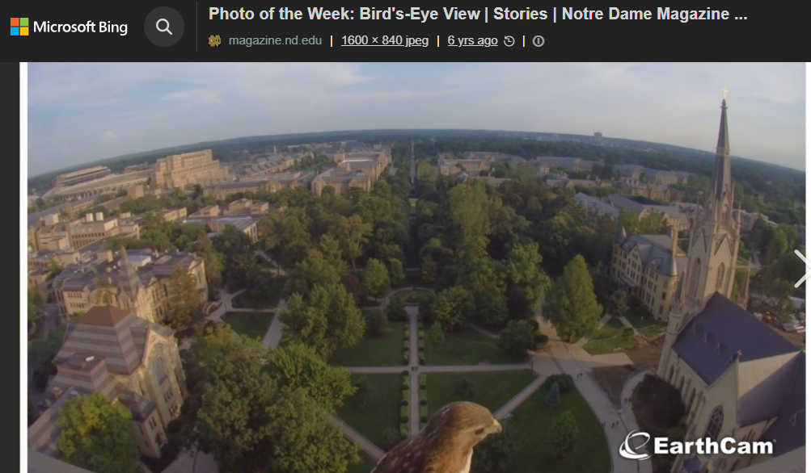

#### Then I opened the university's website and found the address

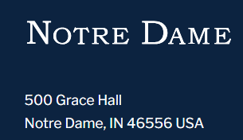

#### Then i searched address on web and found the location.

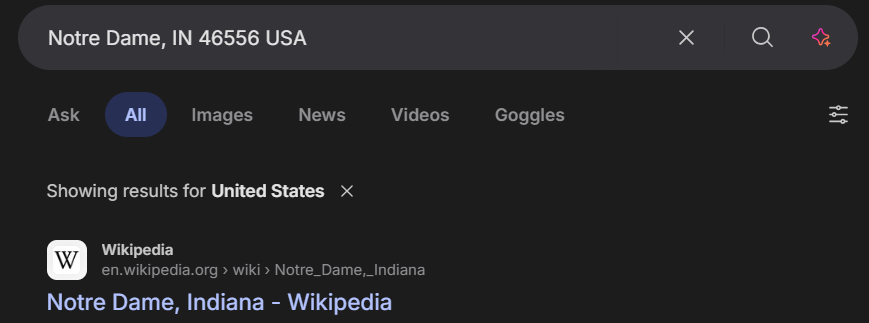

### Thanks for viewing !

#### This challenge was Threat intel category. It was very good to sharpen OSINT, information gathering skills. 

