# Red Stealer Lab
### Difficulty - Easy

## Q1 - Categorizing malware enables a quicker and clearer understanding of its unique behaviors and attack vectors. What category has Microsoft identified for that malware in VirusTotal?
### On virustotal's detection page we can see identified category of malware by Microsoft.
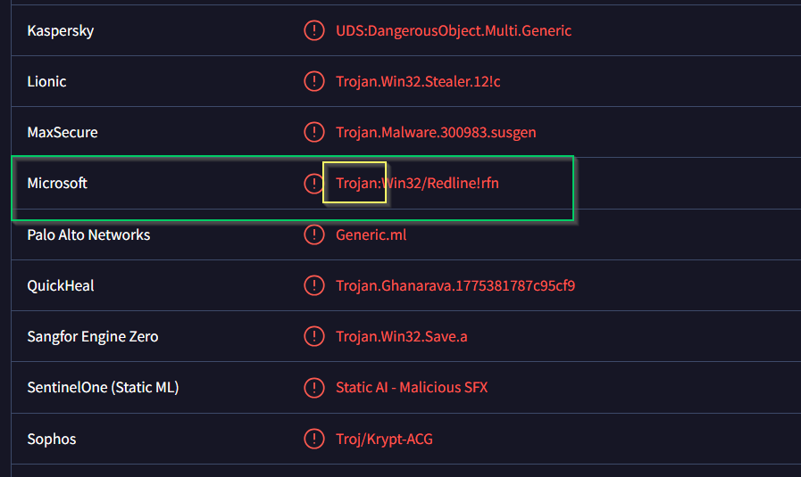

## Q2 - Clearly identifying the name of the malware file improves communication among the SOC team. What is the file name associated with this malware?
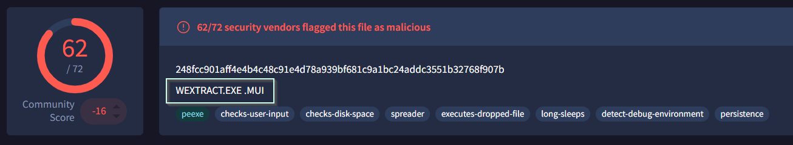

## Q3 - Knowing the exact timestamp of when the malware was first observed can help prioritize response actions. Newly detected malware may require urgent containment and eradication compared to older, well-documented threats. What is the UTC timestamp of the malware's first submission to VirusTotal?

### On details page under history, we can see when it was first submitted on VirusTotal

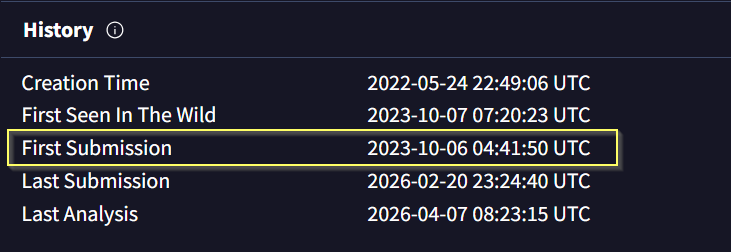

## Q4 - Understanding the techniques used by malware helps in strategic security planning. What is the MITRE ATT&CK technique ID for the malware's data collection from the system before exfiltration?

### In Behaviour Tab, under MITRE ATT&CK Tactics and Techniques we can see Collection techniques and MITRE ATT&CK techniques ID.
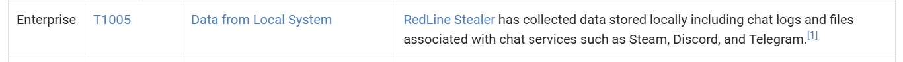

### Also by searching Redstealer on MITRE ATT&CK, we can see Data Collection technique, ID.
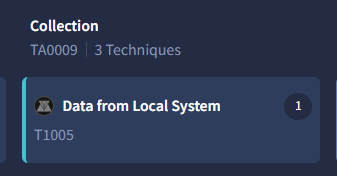

## Q5 - Following execution, which social media-related domain names did the malware resolve via DNS queries?

### In DNS resolution section on Behaviour Tab we can see the social media domain 
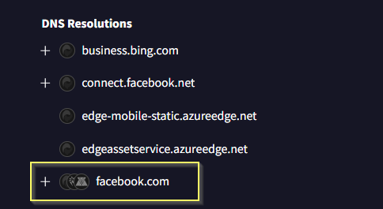

## Q6 - Once the malicious IP addresses are identified, network security devices such as firewalls can be configured to block traffic to and from these addresses. Can you provide the IP address and destination port the malware communicates with?

### In IP Traffic section on Behaviour Tab we can see the IP address malware communicated with

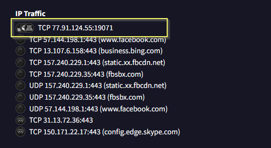

## Q7 - YARA rules are designed to identify specific malware patterns and behaviors. Using MalwareBazaar, what's the name of the YARA rule created by "Varp0s" that detects the identified malware?

### To search anything there's a syntax (eg. here I'm searching a sha256 hash, I used sha256:<hash_value>
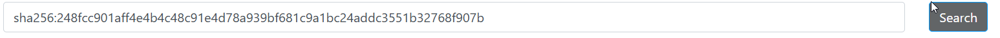

### In YARA sectiom, we can see rule created by `"Varp0s"`
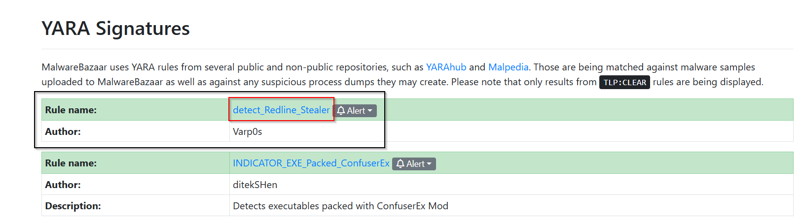

## Q8 - Understanding which malware families are targeting the organization helps in strategic security planning for the future and prioritizing resources based on the threat. Can you provide the different malware alias associated with the malicious IP address according to ThreatFox?

### To search anything there's a syntax (eg. here I'm searching a ioc, I used ioc:<ip_or_anything related to ioc>
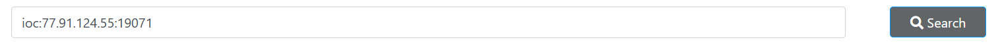

### Here we can see malware alias related to malware.
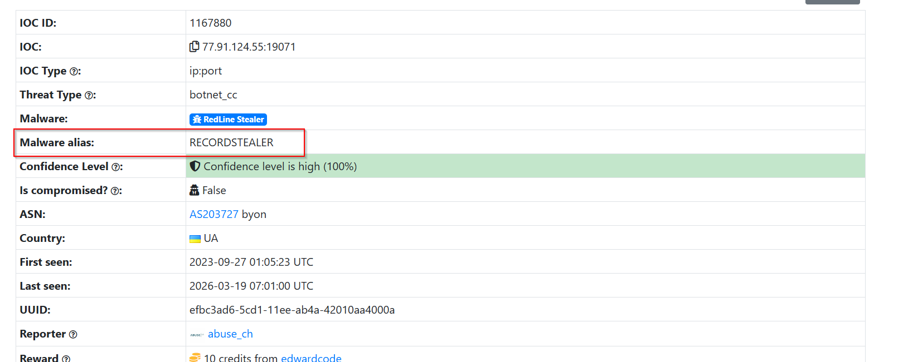

## Q9 - By identifying the malware's imported DLLs, we can configure security tools to monitor for the loading or unusual usage of these specific DLLs. Can you provide the DLL utilized by the malware for privilege escalation?

### On hybrid analysis, we can see in `File Imports` a dll file name.. This dll file is used by malware to change registries, privilige escalation.

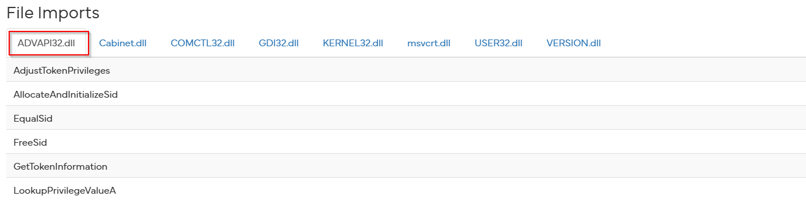

