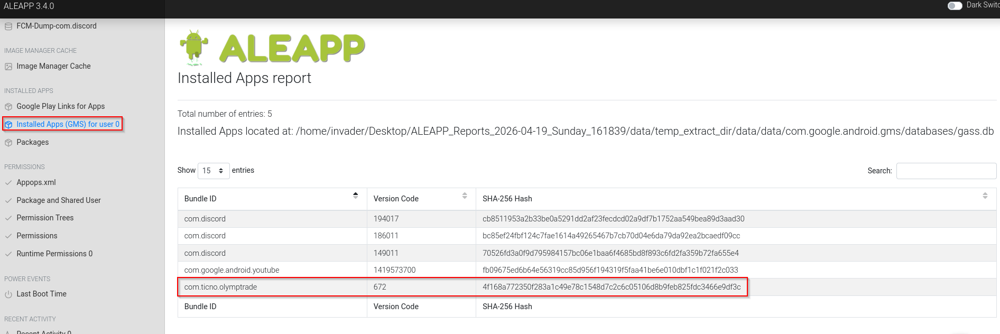
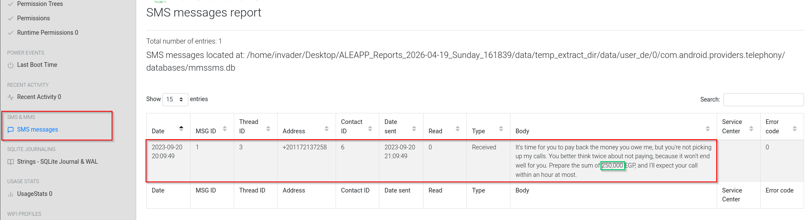
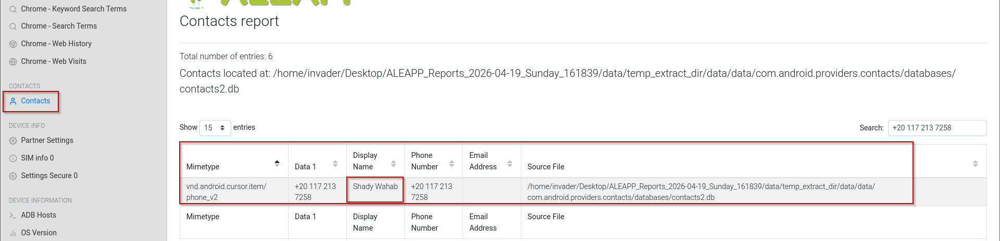
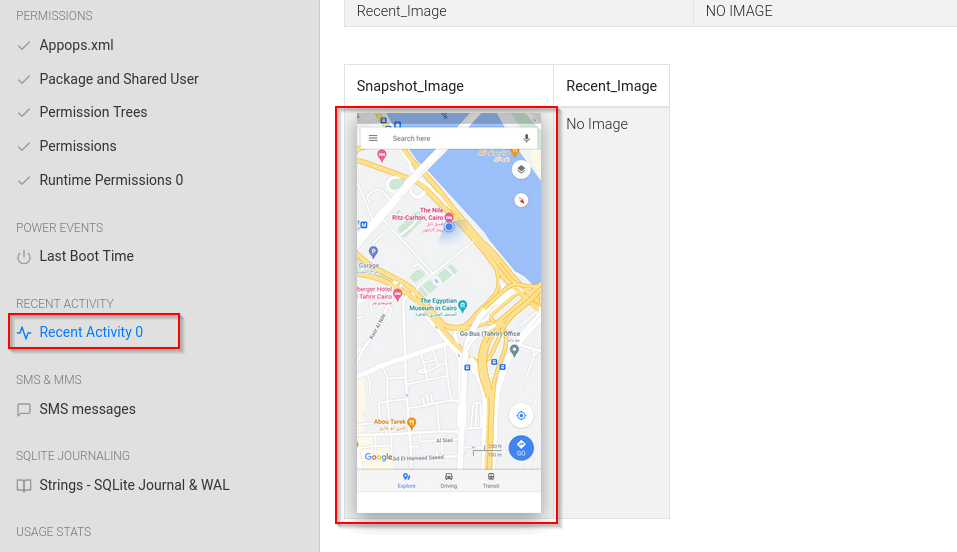
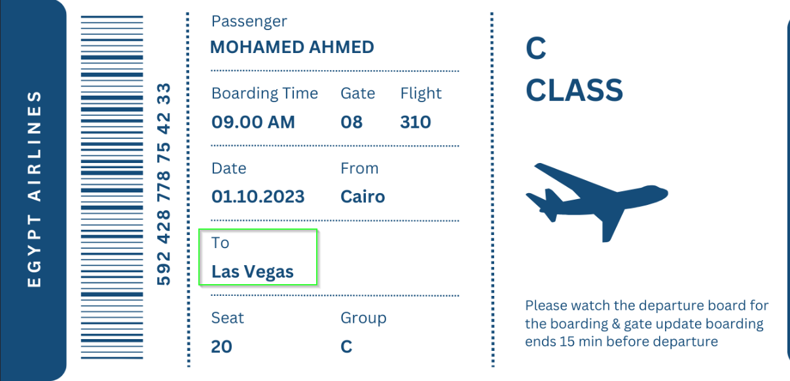
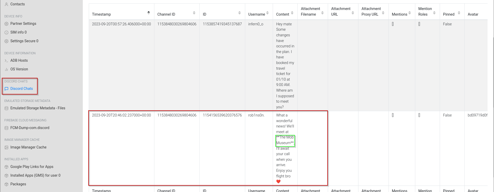

# The Crime Lab - CyberDefenders 
### Difficulty - Easy
### Lab Objectives : Utilize ALEAPP to analyze Android device artifacts, reconstructing a victim's financial details, movements, and communication patterns.

## Q1 - Based on the accounts of the witnesses and individuals close to the victim, it has become clear that the victim was interested in trading. This has led him to invest all of his money and acquire debt. Can you identify the SHA256 of the trading application the victim primarily used on his phone?

##In the `Installed app` section of ALEAPP, I found `olymptrade` which is a trading platform on android listed with it's sha256 

### Answer : 4f168a772350f283a1c49e78c1548d7c2c6c05106d8b9feb825fdc3466e9df3c

## Q2 - According to the testimony of the victim's best friend, he said, "While we were together, my friend got several calls he avoided. He said he owed the caller a lot of money but couldn't repay now". How much does the victim owe this person?

## After checking messages I found a message in which I saw the amount victim owe this person

### Answer : 250000

## Q3 - What is the name of the person to whom the victim owes money?

## When searching number from messages on Contacts we can clearly see the name of the person.

### Answer : Shady Wahab

## Q4 - Based on the statement from the victim's family, they said that on September 20, 2023, he departed from his residence without informing anyone of his destination. Where was the victim located at that moment?

## After checking the recent activity, I found an google maps screenshot at an hotel

### Answer : The Nile Ritz-Carlton

## Q5 - The detective continued his investigation by questioning the hotel lobby. She informed him that the victim had reserved the room for 10 days and had a flight scheduled thereafter. The investigator believes that the victim may have stored his ticket information on his phone. Look for where the victim intended to travel.

## After going to downloads (/temp_extract_dir/data/media/0/Downloads) I saw an plane ticket with location he want to travel.

### Answer : Las Vegas

## Q6 - After examining the victim's Discord conversations, we discovered he had arranged to meet a friend at a specific location. Can you determine where this meeting was supposed to occur?

## On `discord chats` we can see a chat in which he, his friend's are gonna meet at a location.

### Answer : The Mob Museum
