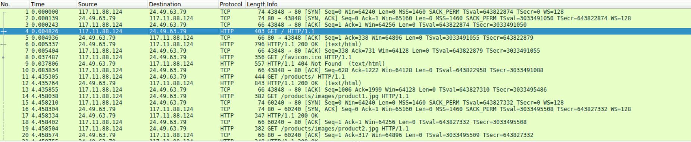
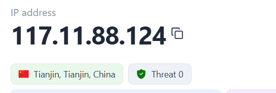
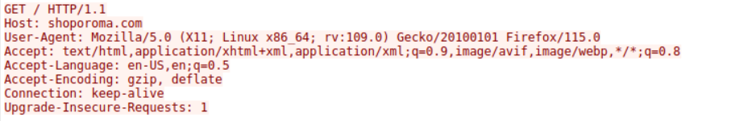
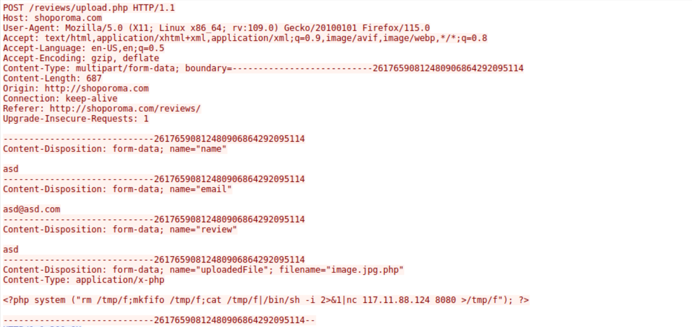
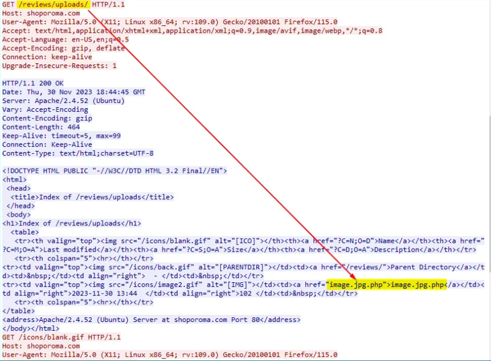
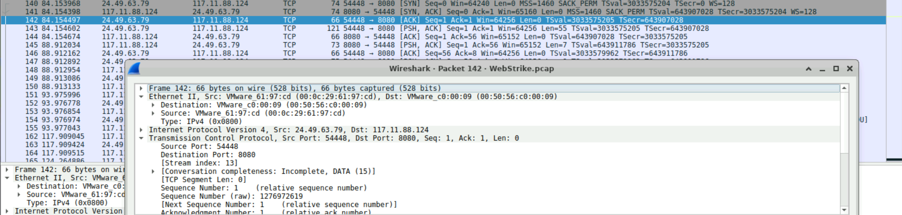
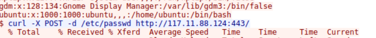

# WebStrike - CyberDefenders 
### Difficulty - Easy

## Q1 - Identifying the geographical origin of the attack facilitates the implementation of geo-blocking measures and the analysis of threat intelligence. From which city did the attack originate?

Here we can see ip address 117.11.88.124 making a HTTP `GET` request to 24.49.63.79. Now after checking IP's geolocation, we found location of Attacker.

### Answer : Tianjin

## Q2 - Knowing the attacker's User-Agent assists in creating robust filtering rules. What's the attacker's Full User-Agent?
Here we can see the User-Agent of Attacker.

### Answer : Mozilla/5.0 (X11; Linux x86_64; rv:109.0) Gecko/20100101 Firefox/115.0

## Q3 - We need to determine if any vulnerabilities were exploited. What is the name of the malicious web shell that was successfully uploaded?
A HTTP `POST` method is used to upload a reverse shell.

## Q4 - Identifying the directory where uploaded files are stored is crucial for locating the vulnerable page and removing any malicious files. Which directory is used by the website to store the uploaded files?
The php reverse shell is uploaded to this location.

## Q5 - Which port, opened on the attacker's machine, was targeted by the malicious web shell for establishing unauthorized outbound communication?

## Q6 - Recognizing the significance of compromised data helps prioritize incident response actions. Which file was the attacker attempting to exfiltrate?

