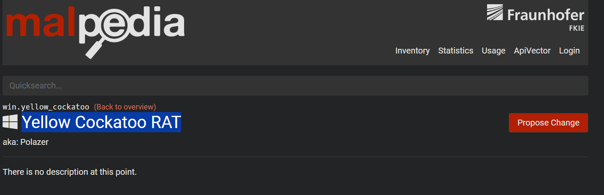
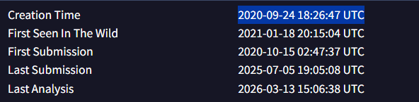
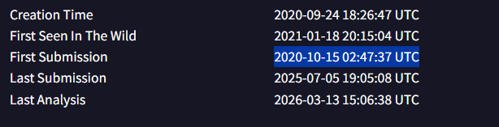
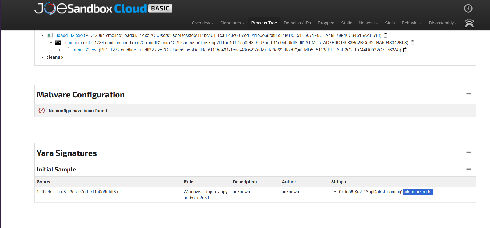
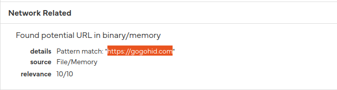

# Yellow RAT
### Difficulty - Easy

## Q1 - Understanding the adversary helps defend against attacks. What is the name of the malware family that causes abnormal network traffic?

If we do a basic web-search of lab name (yellow rat) we can see threat detection reports of this malware, and opening one of this reports we can find our first answer.

### Answer : Yellow Cockatoo RAT

## Q2 - As part of our incident response, knowing common filenames the malware uses can help scan other workstations for potential infection. What is the common filename associated with the malware discovered on our workstations?

As we can see this is the name of the file.

### Answer : 111bc461-1ca8-43c6-97ed-911e0e69fdf8.dll

## Q3 - Determining the compilation timestamp of malware can reveal insights into its development and deployment timeline. What is the compilation timestamp of the malware that infected our network?

Compilation timestamp means the time when the malware program was compiled into an executable file. As we can see in virustotal it was compiled on -
### Answer : 2020-09-24 18:26

## Q4 - Understanding when the broader cybersecurity community first identified the malware could help determine how long the malware might have been in the environment before detection. When was the malware first submitted to VirusTotal?

We can see it was first submitted on - 
### Answer - 2020-10-15 02:47

## Q5 - To completely eradicate the threat from Industries' systems, we need to identify all components dropped by the malware. What is the name of the .dat file that the malware dropped in the AppData folder?
When I searched   `FILE NAME` (111bc461-1ca8-43c6-97ed-911e0e69fdf8.dll) on google, I found joeSandbox report and in report I found the `.dat` file i was finding.
### Answer : solarmarker.dat

## Q6 - It is crucial to identify the C2 servers with which the malware communicates to block its communication and prevent further data exfiltration. What is the C2 server that the malware is communicating with?

As we can see in screenshots of `Hybrid Analysis & Virustotal` a domain is found in memory, Which indicate C2 address also I also confirmed this in joeSandbox.
Answer : https://gogohid.com

